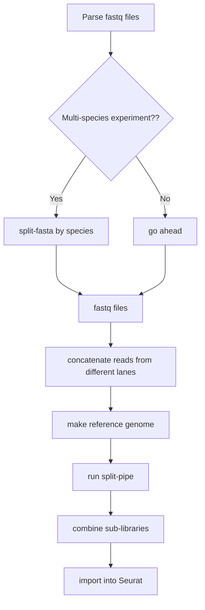

# parse_single_cell_analysis

```mermaid
flowchart TD
    A[Parse fastq files] --> B{Multi-species experiment??};
    B -- Yes --> C[split-fasta by species];
    B -- No --> D[go ahead];
    C ---> E[Enjoy the weekend];
    D ---> E[fastq files]
    E --> F[concatenate reads from different lanes]
    F --> G[make reference genome]
    G --> H[run split-pipe]
    H --> I[combine sub-libraries]
    I --> J[import into Seurat]
```
#### results interpretation
- Barcode plot explained [here](https://www.10xgenomics.com/support/software/cell-ranger/latest/advanced/cr-barcode-rank-plot)
